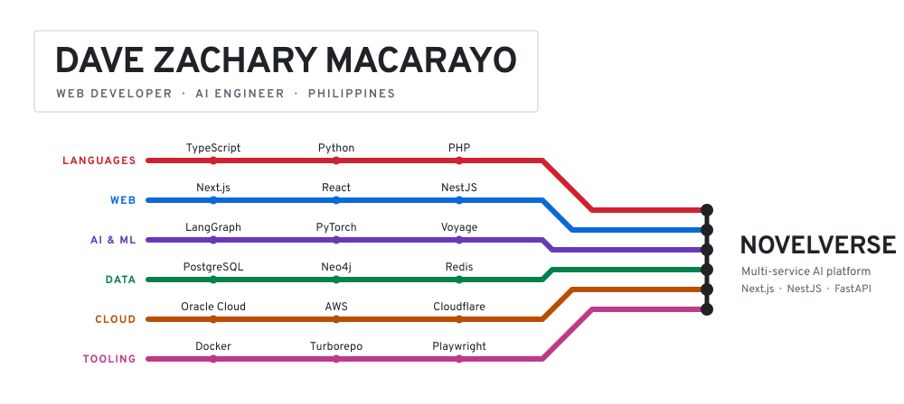
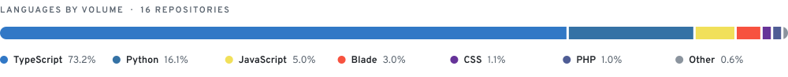

<!--
Generated by scripts/build_readme.py. Edit the script, not this file.

THESIS: a stack is a network, not a logo wall. Colour names the line (the
layer), never the vendor, and the stations are where the work connects.
WORLD: Beck/Vignelli transit diagram. Six line colours on GitHub's own canvas,
transparent ground, Overpass drawn to outlines, 45-degree kinks, tick stations,
circle-and-bar interchange. Documented in DESIGN.md.
RULE: every station on the map is something NovelVerse actually runs, because
every line terminates there. Skills used elsewhere live in Stack instead.
-->

Computer Engineering graduate building production AI systems end to end: Postgres schema
and retrieval pipelines, a multi-provider model router, and the interface people actually
read. Based in the Philippines. [Portfolio](https://debzakari.vercel.app) · open to opportunities.

## Stack

<a href="https://novelverse.ink">
<picture>
  <source media="(prefers-color-scheme: dark) and (max-width: 600px)" srcset="assets/map-narrow-dark.svg">
  <source media="(prefers-color-scheme: light) and (max-width: 600px)" srcset="assets/map-narrow-light.svg">
  <source media="(prefers-color-scheme: dark)" srcset="assets/map-wide-dark.svg">
  
</picture>
</a>

Each line is a layer. Colour marks the line, not the vendor. Every station above runs in
NovelVerse; the rest of what I use is below.

     

      

      

     

     

      

Full inventory: everything else in production use

 

**Web & realtime**

               

**Model providers**

        

**Retrieval & ranking**

      

**Speech**

   

**Vision & biometrics**

   

**Data & storage**

     

**Cloud & infrastructure**

         

**Quality & safety**

      

**Hardware**

   

## Selected work

**[NovelVerse](https://novelverse.ink)** is a multi-service AI writing platform, built solo. The
repository is private. A Turborepo/pnpm monorepo splitting a Next.js reader and manuscript
editor, a NestJS + Fastify business API, and a FastAPI AI service. Live collaborative
editing over Yjs and Hocuspocus; hybrid retrieval across pgvector and a Neo4j knowledge
graph; a multi-provider model router with circuit breaking and per-provider budgets across
nine LLM vendors; a TTS/STT gateway over four speech providers. Runs on an OCI Ampere A1
host behind Cloudflare, with blue-green releases, nightly backups and monthly recovery
drills.

**[portfolio](https://github.com/DebZakari/portfolio)** is a universe-themed Next.js site with
a Canvas 2D galaxy and a black-hole cursor, plus a content-first Focus mode for anyone who
would rather just read. Live at [debzakari.vercel.app](https://debzakari.vercel.app).

**Biometrics and computer vision.** [Iris detection with YOLO](https://github.com/DebZakari/Iris-Detection-Using-YOLO), [iris segmentation with U-Net](https://github.com/DebZakari/UNet-PyTorch-Iris-Segmentation), and TensorFlow 2 ports of [ArcFace](https://github.com/DebZakari/arcface-tf2-colab) and [RetinaFace](https://github.com/DebZakari/retinaface-tf2-colab).

## Activity

<picture>
  <source media="(prefers-color-scheme: dark) and (max-width: 600px)" srcset="assets/langs-narrow-dark.svg">
  <source media="(prefers-color-scheme: light) and (max-width: 600px)" srcset="assets/langs-narrow-light.svg">
  <source media="(prefers-color-scheme: dark)" srcset="assets/langs-wide-dark.svg">
  
</picture>

<picture>
  <source media="(prefers-color-scheme: dark)" srcset="https://streak-stats.demolab.com?user=DebZakari&hide_border=true&background=00000000&stroke=8B949E&ring=A78BFA&fire=A78BFA&currStreakNum=E6EDF3&sideNums=E6EDF3&currStreakLabel=8B949E&sideLabels=8B949E&dates=8B949E&excludeDaysLabel=8B949E">
  
</picture>

<picture>
  <source media="(prefers-color-scheme: dark)" srcset="https://github-readme-activity-graph.vercel.app/graph?username=DebZakari&bg_color=00000000&hide_border=true&hide_title=true&grid=false&radius=6&color=E6EDF3&line=58A6FF&point=A78BFA&area=true&area_color=58A6FF">
  
</picture>

## Contact

  
